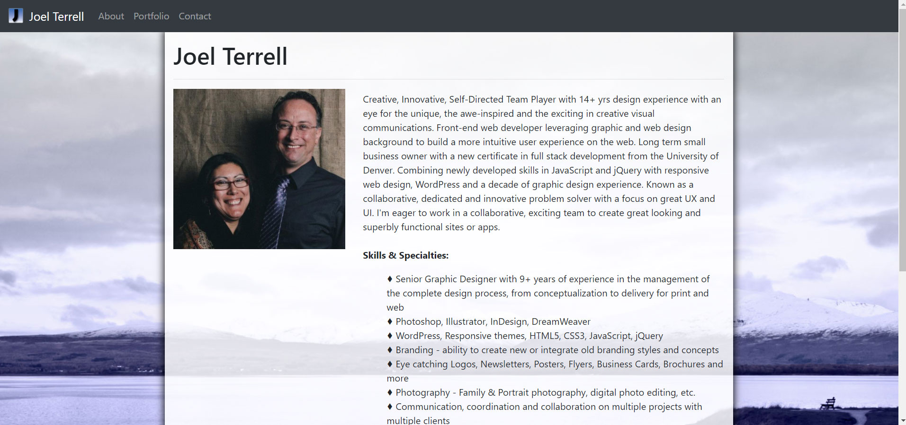
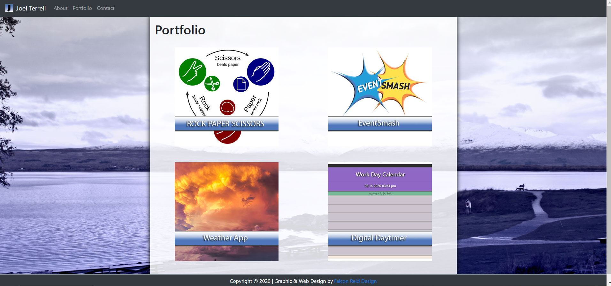
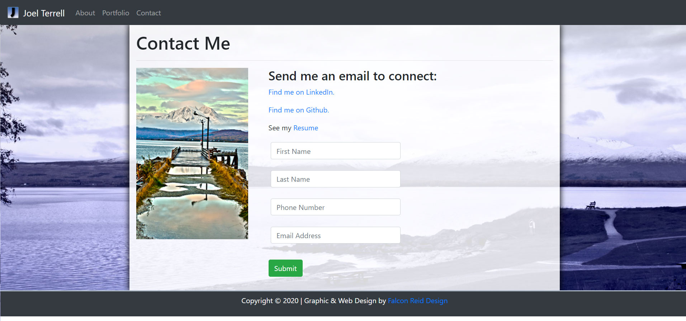

# React Responsive Portfolio
I Used Bootstrap to build a responsive portfolio site.

- Site is a Functional, deployed React application.

- GitHub repository contains README describing the project

- Navbar is consistent on each page.

- Navbar on each page contains links to Home/About, Contact, and Portfolio pages.

- All links are fully functional

- Semantic html is used as much as possible.

- Each page has valid and correct HTML. (used https://validator.w3.org/ - only 3 errors, easily remedied)

- Contains my personalized information. (bio, name, images, links to social media, etc.)

- Properly utilizes Bootstrap components and grid system.

- Used box layout instead of full width

- Added icon and name to navbar

- Added dropshadow to image based links to be more 'interactive'.

## Links
  https://github.com/falconreid/Responsive-Portfolio-JRT
  https://falconreid.github.io/Responsive-Portfolio-JRT/

### Screenshots

